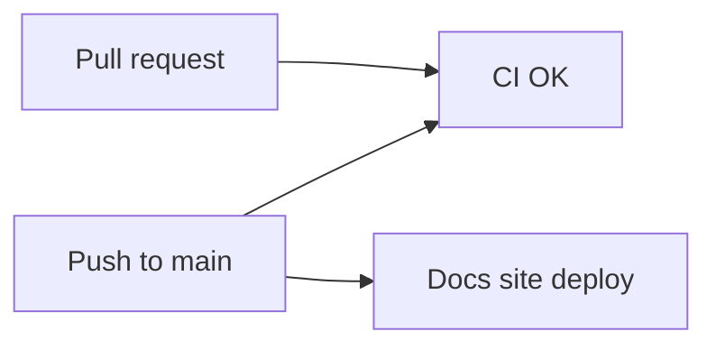

This page is a stub; its content is coming.

```mermaid
flowchart LR
  pr[Pull request] --> ci[CI OK]
  main[Push to main] --> ci
  main --> pages[Docs site deploy]
```

The pipeline is described in [CI/CD](../../../../wiki/ci-cd.md).
